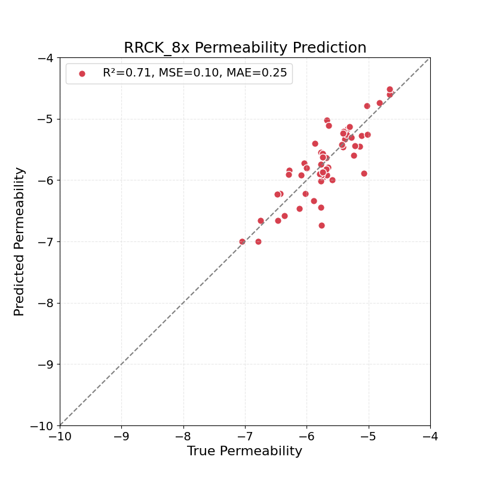
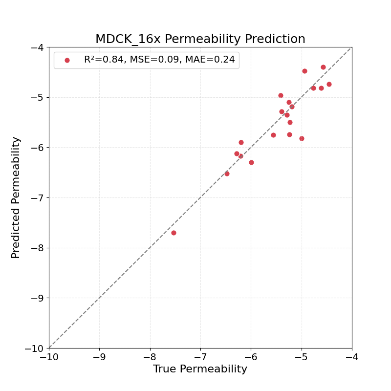

# 2025KCC
  

  
  

  
CPMP는 Molecular Attention Transformer를 기반으로 Cyclic peptide의 permeability를 예측하는 모델임. 본 연구에서는 동일한 분자에 대해 여러 비정규 SMILES 표현을 생성하는 SMILES enumeration을 train dataset에 적용하였으며, 데이터가 희소한 RRCK와 MDCK 데이터셋에서 예측 성능이 개선됨을 확인하였음.  

사후 분석에서 SMILES enumeration이 동일 고리형 펩타이드의 다양한 conformer와 distance matrix를 생성하고, 최종 MAT 임베딩 간 L2 distance에도 차이를 유발함을 확인하였음. 이는 해당 증강이 간접적인 conformer augmentation으로 작동했을 가능성을 시사함.
